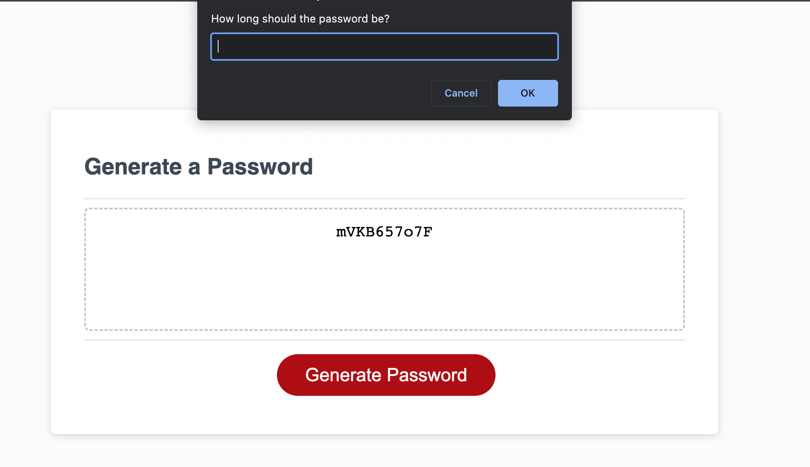

# challenge-3-random-pass

## Description

I modified starter code in the JavaScript file to create an application that generates random passwords based on criteria that users select.

## Usage

To use the application, first click the Generate Password button, then enter the password length, and choose what you would like to include in your password by selecting either OK or Cancel. You must enter a password length and must confirm one character type to generate a random password.

The link to the application is:

https://perfectblue0.github.io/challenge-3-random-pass/

## Credits

The starter code was provided by UCB Coding Bootcamp

## License

Please refer to license in the repo.